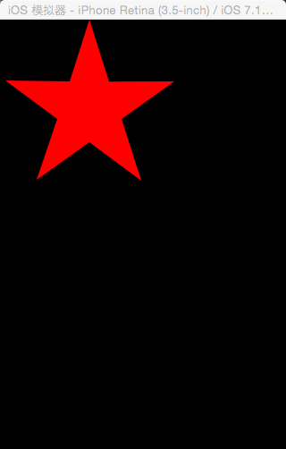

I am fucking disappointed about myself.I had made the fucking decision about two months age that I should spend at least half an hour at my personal project, even the documents related is Ok. But finally I was lost.I spent a lot of my spare time to play Starcraft 2, watch movies and make love with my lovely girlfriend.Really, that's not good enought. Practice about my programming skills is absolutelly neccessary while I am hating the fucking disgusted work what I am doing. 
  
So it's very glad to say I am already back today. This fucking drawing work is inspired by the "Star level board" which using numbers of star to present the Level of soldiers I did in the game project for my current company, I just consider that why could I draw the fucking stars myself. So, here I am. After hours working, I finally draw the stars out. Thank god, I am not the fucking old to write code!
  
Here's the screen shot for star drawing.

  
Maybe I will release the ugly code later.